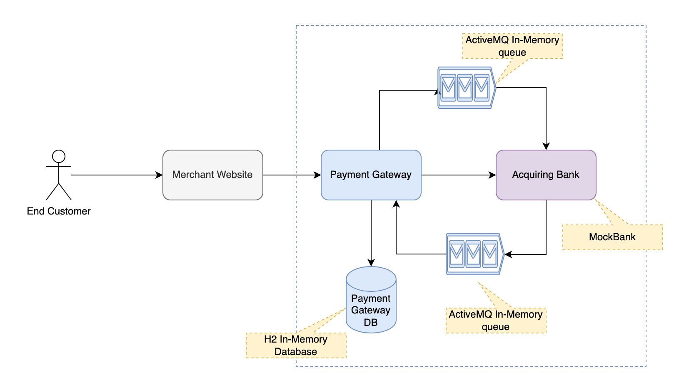
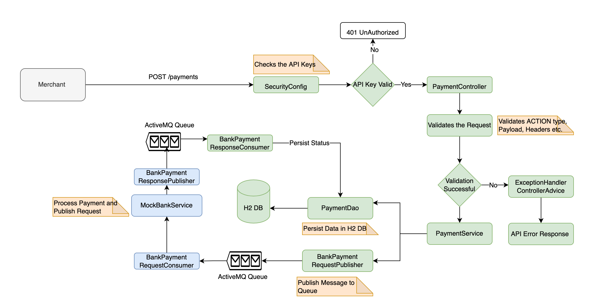
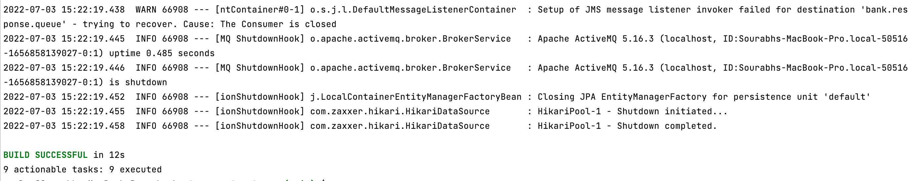
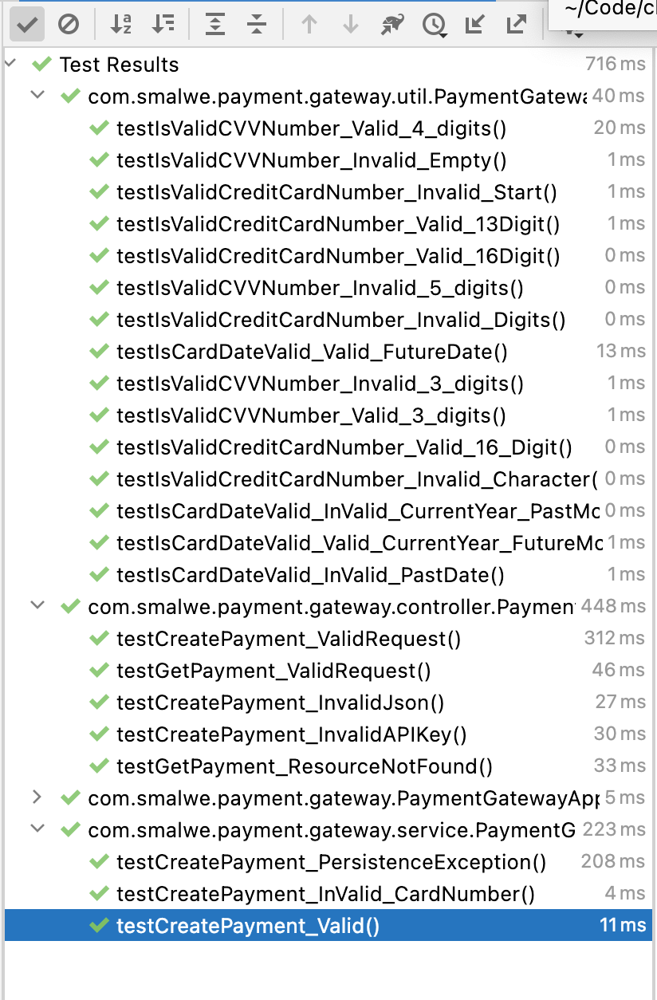
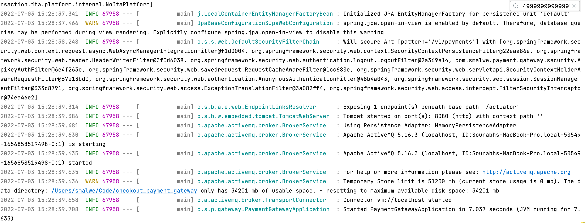
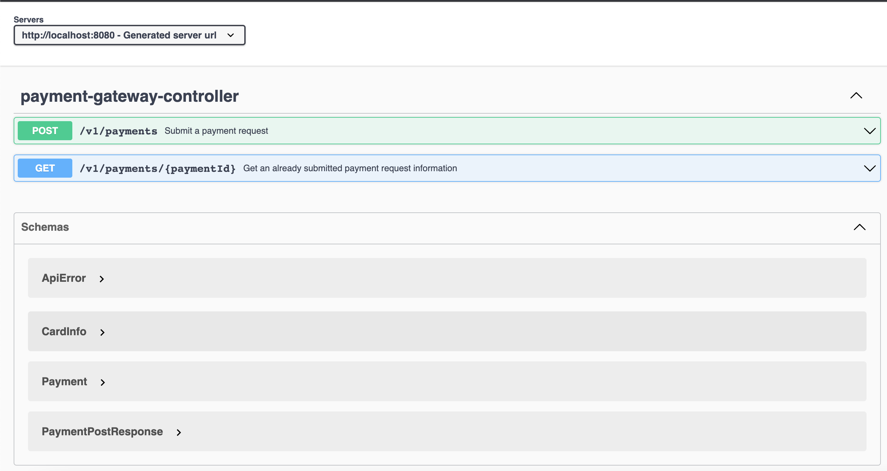
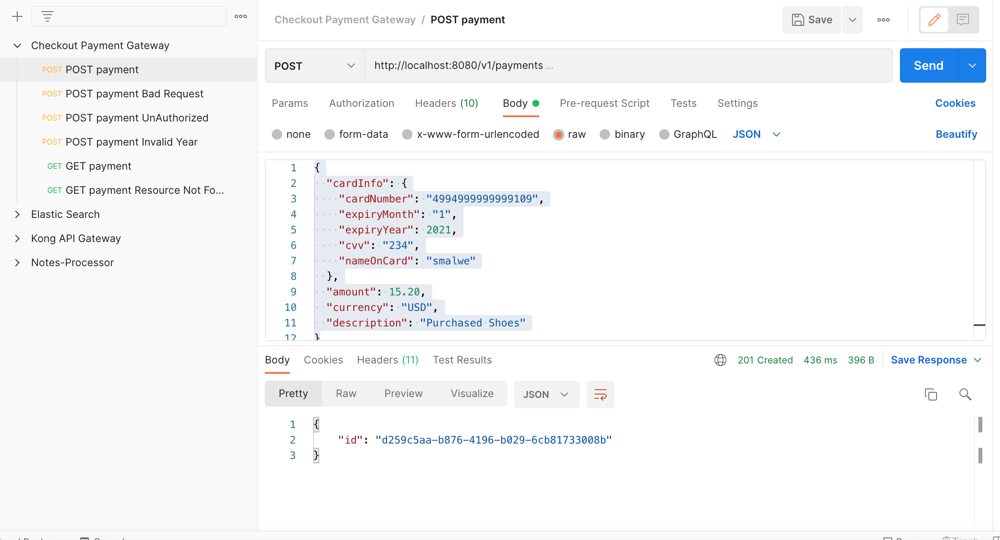

# Solution Overview
Payment Gateway Checkout

Component and Techstack Used:
- `Java` : Programming language used to code solution
- `SpringBoot` : Framework used to build the REST API for Payment Gateway
- `H2 Inmemory Data` : Database to store payment information 
- `ActiveMQ Inmemory Queue` : Messaging Queue to enable the async behaviour between Payment Gateway and Acquiring Bank 
- `Gradle`: Build tool for the java application

## Deliverables Summary
1. Build an API that allows a merchant:
- a. To process a payment through your payment gateway. - `Delivered using POST /v1/payments`
- b. To retrieve details of a previously made payment. - `Delivered using GET /v1/payments/{paymentId}`
2. Build a bank simulator to test your payment gateway API. - `Delivered using MockBankService`

## Assumptions
- Card Details validation logic follows the below rules:
  - A credit card number must have between 13 and 16 digits. It must start with:
  - A credit card can start with 4,5,3,6 as per the below list: 
    - 4for Visa cards
    - 5 for Master cards
    - 3 for American Express cards
    - 6 for Discover cards
- CVV validation logic assumes the below rules:
  - CVV Should have 3 or 4 digits
  - It should have only digits between 0-9
- Bank Simulator will send a success event back only for the below card numbers
  - `4999999999999109`, `5431111111111111`, `5123455806308521`
- Communication between Payment Gateway and Bank Simulator is asynchronous and achieved using In-Memory ActiveMQ component with the below queues:
  - `bank.request.queue` : Payment Gateway sends an event with payment information to Bank Simulator
  - `bank.response.queue` : Bank Simulator send an event with payment status `SUCCESS` or `FAILED` for a given paymentId
- As the communication is async the Payment Gateway marks the initial status of Payment as `PENDING` when the request is received using `POST /v1/payments`
- IDs generated for payment is of type `UUID`
- APIs are secured using the API Keys. Valid apikeys: `apiKey1`,`apiKey2`
- API Documentation is generated in Open API Specification format. Please see the `Running the solution to access the Open API Specification`
- RESTful API Principles are followed:
  - Resource name are based on Noun
  - Operations on the resource  is defined via HTTP actions
  - API is versioned to accommodate any upcoming changes
  - Response code is as per the standards i.e. 
    - 201 for successful POST
    - 200 for successful GET
    - 400 for any invalid data
    - 404 for resource not found
    - 401 for unauthorized access
    - 500 for any application error
- Card masking is done with first  75% of the cardNumber being masked

## Pre-requisite to run the solution
- Java11
- Gradle 7.2
- Prior to running the application on a machine make sure it has port `8080` unoccupied

## Running the solution
- I have already compiled the code and added a runnable jar in the root folder, so there is no need to compile the code again.
- Make sure you are on the root of the project
- Execute jar from commandline: `java -jar checkout_payment_gateway-1.0-SNAPSHOT.jar`
- Postman collection can be directly loaded to run some basic test and can be found in the root folder: `CheckoutPaymentGateway.postman_collection.json` 
- Access Open API Spec UI : `http://localhost:8080/swagger-ui.html`
- Access Open API Spec JSON : `http://localhost:8080/v3/api-docs`
- Health Endpoint : `http://localhost:8080/actuator/health`
- To access the H2 DB please find the details below:
  - Access H2 DB Console: `http://localhost:8080/h2db-console/`
  - H2 Database JDBC URL: `jdbc:h2:mem:payment-gateway-db`
  - H2 UserName: `payment-gateway-user1`
  - H2 Password: `payment-gateway-pass1`
  - Get All Payments Query: `select * from payments;`
  - Get  Card Info Query: `select * from card_info;`

## Steps to build the jar 
**Note**: I have already provided the runnable jar in the root folder, if you are interested in building the application please find the steps below`
- Make sure you are on the root of the project
- Run task to get the 7.4 gradle version  : `gradle wrapper --gradle-version 7.2`
- Run : `./gradlew clean build`
- This will compile, run the test cases and build the executable jar
- Navigate to `build/libs`
- Execute jar from commandline: `java -jar checkout_payment_gateway-1.0-SNAPSHOT.jar`
- Run application without build : `./gradlew bootRun`
- Run testcases without build : `./gradlew test`

## Areas of Improvements
Given the time limit only a set aspects of the solution is being implemented. Below are the some key areas of improvement in the current implementation:
- API Rate Limiter can be added to limit the number of request per Merchant. The requirement is generally driven by the API Pricing Models
- Based on the deployment environment, the build be can dockerized
- To ensure the code quality, the solution can be run through SonarQube
- To make sure to consistent coding guidelines are followed in the organisation it can be run through checkstyle plugin
- More testcases can be added to increase the coverage
- More business logic can be added to make the solution robust. For e.g. Luhn algorithm to check the card number validity
- Proper git branching strategy to followed to avoid any accidental changes to the main branch
- Fine grain RBAC can be implemented based on the merchant resources
- More exhaustive API error handling scenarios can be implemented like 429 (Spike Arrest), 405 Method Not allowed etc.
- Retry mechanism can be introduced while connecting with BankService
- More number of Mock Scenarios can be in the Bank Simulator
## Extra Mile/Bonus Tasks 
- Implemented API Key Based Authentication Mechanism
- Implemented ActiveMQ based event driven pattern to communicate between Payment Gateway and Bank Simulator
- Incorporated automated Open API Spec generation, so that any changes to the code will be reflected automatically in the API spec
- Implemented Health Check Endpoint to let the merchant know the APIs are up or down

## Cloud Technologies
If this solution is to be designed at a production level, there are multiple options available to implement the solution. Below is just one set tools and technologies to achieve this
- `AWS API Gateway`: For exposing the API endpoints to the public
- `Route53` : To configure the domain for the APIs
- `ACM`: Generate the SSH certificates
- `AWS EKS` :  Manged Kubernetes Service acting as an container orchestration layer to deploy different microservices For e.g: Payment Ingestion, Payment Process , BankAdaptor etc. 
- `AWS ECR` : Managed Docker Registry to store the artifacts and ensure the same artefact is promoted from lower environments till production.
- `Confluent Cloud for Kafka`: To publish, subscribe or for any event streaming capability
- `Service Mesh (like Istio or Linkerd)`: If the organisation has multiple microservices, a service mesh is recommended approach to tackle the problemts associated with back presseure, retry mechanism etc.
- `AWS VPC` : To make sure microservices are not exposed to internet and exposed only via Load balancers
- `AWS ALB` : Exposed to internet to receive any API request
- `AWS CloudWatch Logs` : For any Application and Infrastructure Monitoring
- `AWS CloudWatch Alarms` : For getting alerted on any specific API usage metrics
- `Hashicorp Vault` : For storing any DB credentials or external provider service API keys
- `AWS DynamoDB`: For storing any payment information
- `AWS CodeBuild`: CI pipeline to compile, run, build and generate the artefacts
- `AWS CodeDeploy` : CD pipeline to deploy generated artefacts to any environment
- `AWS Autoscalar` : To scale the EKS nodes based on the traffic
- `Terraform` : To automate the deployment of the infrastructure  
- `Auth0`, `Okta` : Stronger authentication mechanism like JWT based authentication along with mTLS can be used. Both OAuth0 an Okta provides such capability 
### Other aspects to be considered:
- For the solution to be highly available: MultiAZ setup is recommended
- Solution to be compliant with PCI-DSS for storing any card related information
- Solution has to be GDPR compliant
- A BCDR(Business Continuity and Disaster Recovery) process to be defined by the organisation and the solution should comply to the defined process
- Solution should be compliant with the defined NFRs by the organisation
- Solution should be secure enough and should be proved by different process like PenTest, Privileged Access Management, Tamperproofing of logs etc.
- Performance and Stress testing for each component of the architecture
- VM Images should be CIS(Level 1 or 2) compliant
- Define API Versioning Strategy and key principles to be shared with the consumers

The selection of the above tools and technologies depends on various factors like use cases, scale, context of the problem, cost, skill set availability etc.

## Implementation Summary
This flowchart  covers the key component of the code to easily understand the implementation

## Evidence of the Solution
### Application Build Evidence

### Application Test Evidence

### Application Run Evidence

### Open API Spec Evidence

### Postman Script Evidence
